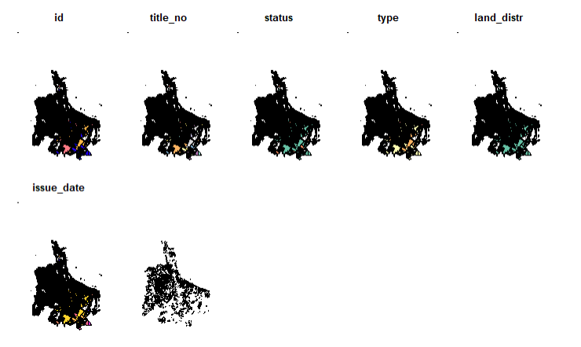

Leasehold properties pop up occasionally in Auckland, so I wanted to see where they are. 

<!--more-->


```{r setup, include=FALSE}
knitr::opts_chunk$set(echo = TRUE)
library(sf)
library(ggplot2)
library(dplyr)
library(data.table)
library(leaflet)
library(here)
```

## Maps

I want to know where the leasehold properties are in Auckland because they are annoying when looking for a house to buy. This data is included in the Property Titles data available at LINZ https://data.linz.govt.nz/data/?q=title 

The data is available with a free account to download. The files for the whole of NZ are pretty big, so I've put *linz-files/* in the `.gitignore` file to keep the files that are hundreds of megabytes out of the repo.  

The resulting chart is here at the top of the post, then I'll show all the rest of the work I did to get to the result. 

First, read in the data. 

```{r read}
sf_file <- here::here('static', 'data', 'linz-files', 'nz-property-titles.shp')

titles <- st_read(sf_file)

```

Along the way I was thinking I needed to do some fancy colour work, and combine geometries to pick the ones that had Leasehold, but in the end using a base map and filtering for the relevant property titles worked a treat. 

```{r leaf_results}

titles_akl_lease <- titles |> 
    filter(type == 'Leasehold', land_distr == 'North Auckland')

titles_akl_lease <- st_transform(st_as_sf(titles_akl_lease), 4326)

box = c(xmin=174, xmax=175.3, ymin=-37.0877296, ymax=-36.6960666)

titles_akl_lease <- st_crop(titles_akl_lease, xmin=174, xmax=175.3, ymin=-37.0877296, ymax=-36.6960666)

leaflet() |> 
    addProviderTiles("CartoDB.Positron") |> 
    addPolygons(data = titles_akl_lease, fillColor = 'red', weight = 2, col = 'black')

```

## Exploration 

Get the names of the columns

```{r}

names(titles)

```

View some of the data

```{r head}

head(titles)

```

This just shows that the geometric data is all Multipolygon i.e. shapes

```{r geom}

st_geometry_type(head(titles))

```

Coordinate Reference System data

```{r crs}

st_crs(titles)

```

Bounding Box data: maximum and minimum of the Lat-Long

```{r box}

st_bbox(titles)

```

What data do we have here in some of the columns? status, type, land_distr could be interesting and help with restricting the view. 

First let's try `dplyr` 

```{r status}

# titles |> 
#     count(status)

```

This takes too long! It doesn't produce an error, just never really finishes. Maybe we should try `data.table`? 

Also: We don't need the `geometry` column which takes up, presumably, a lot of memory. See references for how to actually remove a geometry column. 

```{r sizes}

object.size(titles)

titles_df <- st_drop_geometry(titles)

object.size(titles_df)

```

Let's try this again to see if it makes a difference. Wow, yes. 

```{r status2}

titles_df |>
    count(status)

```

Convert to data.table just for fun

```{r datatable}

titles_dt <- as.data.table(titles_df)

```

count and group by are a bit different for data.table 

```{r}

titles_dt[, .(count = .N), by = status]

```


```{r type}

titles_df |> 
    count(type, sort=TRUE)

```

```{r land, rows.print = 12}

titles_df |> 
    count(land_distr) 

```

```{r guar}

titles_df |> 
    count(guarantee_)

```

I think I just want to restrict to South Auckland. We will see if that prints, anyway. 

```{r akl}

titles_akl <- titles |>  
    filter(land_distr == 'South Auckland')

```

Display!

```{r plot1}

# plot(titles_akl)

```



Plot took a while, and creates a different chart for each column of data. Not quite what we want. Or I could learn to control `plot()` properly. Or we could try ggplot, with the smallest region, to make sure it works. 

```{r plot2}

titles |> 
    filter(land_distr == 'Westland') |> 
    ggplot() + 
    geom_sf()

```

Choose the column that we want to plot. This is kind of nonsense but we are making progress. 

```{r plot3}

titles_akl_plot <- titles_akl |> select(type)

plot(titles_akl_plot)

```

I think at this stage I want to jump to `leaflet` so I can zoom on the map. 

```{r leaf1}

titles_westland <- titles |> filter(land_distr == 'Westland')

titles_west_sf <- st_transform(st_as_sf(titles_westland), 4326)

leaflet(titles_west_sf) %>% 
  addProviderTiles("CartoDB.Positron") %>% 
  addPolygons(color = "green")

```

Create a colour column to show the Leasehold properties. 

```{r leaf2}

titles_west_color <- titles_west_sf |> 
    mutate(colour = if_else(type == 'Leasehold', 'red', 'grey'))

leaflet() |> 
    addProviderTiles("CartoDB.Positron") |> 
    addPolygons(data = titles_west_sf, fillColor = titles_west_sf$colour, weight = 2, col = 'black')

```

OK, I don't know if there are any Leasehold in Westland, they aren't really showing on the map, let's check. 

```{r leaf3}

titles_df |> 
    filter(land_distr == 'Westland') |> 
    count(type, sort=TRUE)

```

There's a few, but will they show up as Red? 

```{r leaf4}

titles_west_lease <- titles_west_sf |> 
    filter(type == 'Leasehold')

leaflet() |> 
    addProviderTiles("CartoDB.Positron") |> 
    addPolygons(data = titles_west_lease, fillColor = 'red', weight = 2, col = 'black')

```

I don't need to show all the parcels of land! I think with the background tiles this will work out just fine. 

I also want to restrict the data because "North Auckland" is everything north of Auckland - the land designations must be based on the old province boundaries, the basis of anniversary days but not what we think of as regions these days. 

These are the links for my north and south boundaries: 

https://www.google.com/maps/place/36%C2%B041'45.9%22S+174%C2%B045'41.4%22E/@-36.6960666,174.7566341,17z/

https://www.google.com/maps/place/37%C2%B005'15.8%22S+174%C2%B056'21.7%22E/@-37.0877296,174.9379149,17z/


```{r leaf5}

titles_akl_lease <- titles |> 
    filter(type == 'Leasehold', land_distr == 'North Auckland')

titles_akl_lease <- st_transform(st_as_sf(titles_akl_lease), 4326)

box = c(xmin=174, xmax=175.3, ymin=-37.0877296, ymax=-36.6960666)

titles_akl_lease <- st_crop(titles_akl_lease, xmin=174, xmax=175.3, ymin=-37.0877296, ymax=-36.6960666)

leaflet() |> 
    addProviderTiles("CartoDB.Positron") |> 
    addPolygons(data = titles_akl_lease, fillColor = 'red', weight = 2, col = 'black')

```

This checks out: the land around Cornwall Park, some scattered areas in St Johns, Kohimarama, and lots of areas in the city. There doesn't seem to be any good pattern. 

Oh well. 

## References

Some links that I used 

https://jsta.github.io/glatos-spatial_workshop_materials/01-vector-open-shapefile-in-r/  

https://dev.to/chrisgreening/visualizing-shapefiles-in-r-with-sf-and-ggplot2-58aj

https://gis.stackexchange.com/questions/224915/extracting-data-frame-from-simple-features-object-in-r

https://r-spatial.github.io/sf/articles/sf1.html

https://www.r-bloggers.com/2019/04/zooming-in-on-maps-with-sf-and-ggplot2/

https://gis.stackexchange.com/questions/430810/read-geo-spatial-data-in-r-via-leaflet

https://stackoverflow.com/questions/51931610/r-leaflet-fill-polygons-with-colours

https://r-spatial.github.io/sf/reference/st_crop.html


